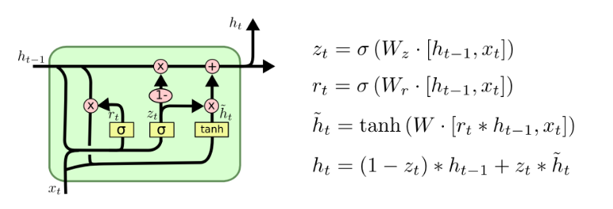
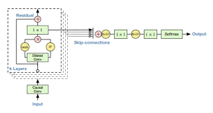
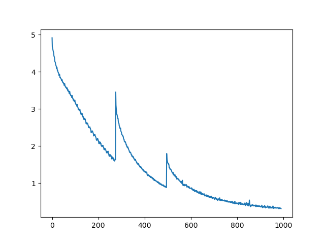

# CodeAlpha Music Generation with AI
---
## Overview

Welcome to the **CodeAlpha Music Generation with AI** project! This project demonstrates an AI-driven approach to generating piano music using deep learning techniques. Trained on a dataset of Schubert piano compositions, this model leverages state-of-the-art technologies to compose new and unique piano pieces based on seed inputs.
---
## Project Highlights

- **AI Models Used**: LSTM and Wavenet-inspired architectures for music generation.
- **Training Data**: Piano compositions by Schubert.
- **Generated Output**: MIDI files of newly composed piano music.
---
## Technologies

This project utilizes the following technologies:

- **PyTorch**: For implementing the LSTM and Wavenet models.
- **TensorFlow**: For various machine learning tasks.
- **Music21**: For handling and generating MIDI music files.
---
## Models
---
### LSTM Model

Long Short-Term Memory (LSTM) networks are used to predict sequences of piano notes. This model captures the temporal dependencies in music sequences and generates coherent musical outputs.


---
### Wavenet-inspired Model

Inspired by Wavenet, this model uses 1D convolutions with dilated convolutions to generate music sequences. While more complex, it provides insights into how different neural network architectures perform in music generation.



---
## Training Details

- **Hardware**: Trained on NVIDIA GeForce GTX 1080 Ti GPU.
- **Training Duration**: Approximately 2.5 - 3 hours.
- **Training Process**: 
  - Initial 25 epochs: Predicting the next note.
  - Epochs 25 to 44: Predicting the next 4 notes.
  - Epochs 45 to 90: Predicting the next 8 notes.
---
### Loss History


---
### Accuracy Metrics

| Mode       | Correct Predictions | Total Predictions | Accuracy (%) |
|------------|----------------------|-------------------|--------------|
| Training   | 406,824              | 448,760           | 90.66        |
| Validation | 110,044              | 128,224           | 85.82        |
| Testing    | 55,016               | 64,112            | 85.81        |
---
## Results

Generated music files are available in the `/Outputs` directory. These files are in MIDI format. To listen to these compositions, you can convert them to MP3 format and adjust the tempo as needed.
---
## Getting Started
---
### Installation

1. **Clone the Repository**:
   ```sh
   git clone https://github.com/your-username/CodeAlpha_Music_Generation_With_AI.git
   ```

2. **Set Up Virtual Environment**:
   ```sh
   cd CodeAlpha_Music_Generation_With_AI
   python3 -m venv venv
   source venv/bin/activate
   ```

3. **Install Dependencies**:
   ```sh
   pip install -r requirements.txt
   ```
---
### Running the Code

1. **Train the Model**:
   ```sh
   python train.py
   ```

2. **Run the Jupyter Notebook**:
   ```sh
   jupyter notebook
   ```
   Open `Music_Gen_AI_Train.ipynb` to train the model.

3. **Test with Pretrained Model**:
   - Open `Music_Gen_AI_Test.ipynb` in the Jupyter notebook.
---
## Acknowledgments

This project was inspired by [Shaantanu Kulkarni’s Music-Gen-AI](https://github.com/shaantanu314/Music-Gen-AI) and [YouTube Tutorial](https://youtu.be/NZU0f580Fkg?si=3wID7m-3PawZEi_N). Special thanks to the community for their contributions and insights.
---

## Contact

For questions or comments, please reach out to [us](mailto:khushnoor7525.2020@gmail.com)
